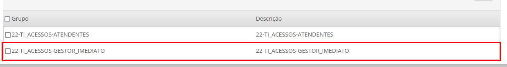
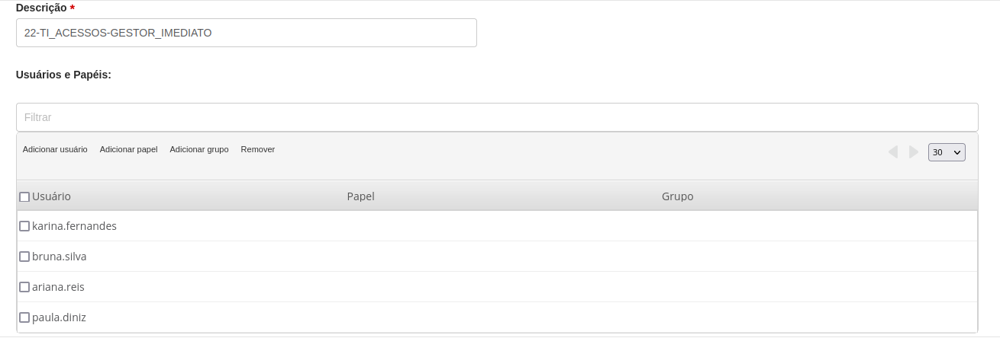
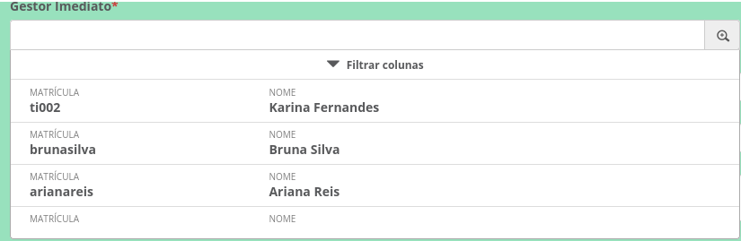

# DATASET: dsUsuariosPorGrupo

> Iremos utilizar o reloadZoomFilterValues para nos ajudar a filtrar os usuários que pertencem a determinado Grupo em um campo Zoom baseado no dataset dsUsuariosPorGrupo.

O campo que estaremos nos baseando para a construção desse exemplo será o Gestor Imediato do processo 22-TI_ACESSOS.

## Campo no HTML:
````
<input title="ds_atendente_acessos" class="form-control" placeholder="Gestor Imediato" type="zoom" zoomvalue="colleagueId" 
dataset="dsUsuariosPorGrupo" datasetvalue="colleagueName" id="gestor_altAcesso" name="gestor_altAcesso" data-zoom="{
                    'displayKey':'colleagueName',
                    'datasetId':'dsUsuariosPorGrupo',
                    'maximumSelectionLength':'1',
                    'placeholder':'Escolha um usuário',
                    'filterValues':'active,true',
                    'fields':[{
                      'field':'colleagueId',
                      'label':'Matrícula'
                      },{
                      'field':'colleagueName',
                      'label':'Nome'
                      }]
                    }">
````

## Criação do Grupo:

A atribuição do usuário será determinado pelo grupo, o padrão para nomenclatura segue:

> XX-PROCESSO-NOME_DO_CAMPO

1. Criamos o nosso grupo baseado no "Processo + Nome do Campo"


2. Inserimos os usuários que pertencem ao grupo


3. Resultado


## Implementação da filtragem XX-PROCESSO.js:

Iremos chamar a função do reloadZoomCarregado logo no inicio do nosso arquivo.js onde será executado assim que o javascript estiver pronto
````
/* 22-TI_ACESSOS.js */
$(document).ready(function () {
  setFilterZoom();
  reloadZoomCarregado("gestor_novoAcesso","22-TI_ACESSOS-GESTOR_IMEDIATO")
  reloadZoomCarregado("gestor_altAcesso","22-TI_ACESSOS-GESTOR_IMEDIATO")
});

...

function reloadZoomCarregado(campo, grupoSelecionado) {
	if (window[campo].element) {
		reloadZoomFilterValues(campo, `groupId,${grupoSelecionado}`);
		return true;
	} else {
		setTimeout(() => { reloadZoomCarregado(campo, grupoSelecionado); }, 300);
	}
}
````
