# Guia de Configuração e Contribuição de Processos no GitHub

> Requisitos para esse Guia: Git instalado na sua maquina

Quando se trata de Git, ele nos dá uma grande flexibilidade para configurar o repositório como bem desejarmos, portanto, que fique claro que:

- A TOTVS por si só não possui nenhuma recomendação nem diretiva sobre a utilização do GitHub pra controlar os processos do FLUIG, portanto esse processo foi desenhado da forma que melhor acreditamos servir o propósito de controle de versionamento, sendo passível de alterações e refinamentos.

## 1. Criação do Repositório do Processo na Organização do GitHub


Depois de conseguir acesso a Organização do GitHub através do Gerente de Projetos você irá acessar a aba "Repositories/Repositórios" e irá selecionar o botão verde "Novo Repositório", como demonstrado abaixo:

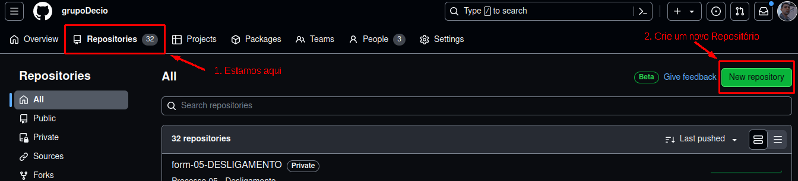
Para os processos novos, o padrão de nomenclatura segue:

**form-XX-NOME_DO_PROCESSO**

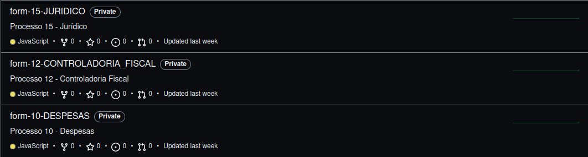

Para os processos antigos, o padrão é:

**form-Ab.Solicitacao-NomeDoProcesso**

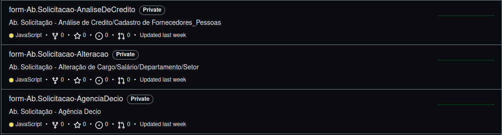
Sendo assim, você irá inserir o nome e descrição do novo repositório de acordo com esses padrões:

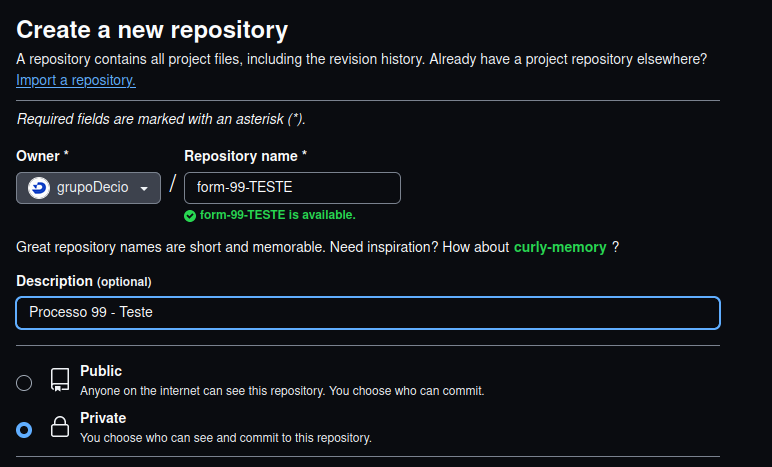

O resto das configurações não é necessário alteração, crie o novo repositório. Após a criação do repositório, copie o URL do caminho para o repositório.

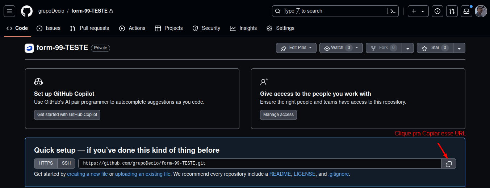

Você abrirá um terminal, navegará até o diretório onde deseja armazenar esse repositório do Git, irá clonar o Repositório na sua maquina e entrar nessa pasta.

(Meu sistema operacional é baseado no Linux, você pode fazer o mesmo através do Windows pelo Powershell ou no terminal do seu VSCode)

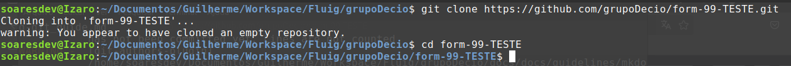
Já possuímos o Repositório que irá armazenar nosso processo, agora iremos inserir os arquivos que desejamos que o git controle as alterações, você deve inicialmente:

### 1.1 Baixar o arquivo ZIP do Processo do site do FLUIG e inseri-lo na pasta

Processos-Fluig -> Configurar Processos -> Selecione o Processo -> Exportar

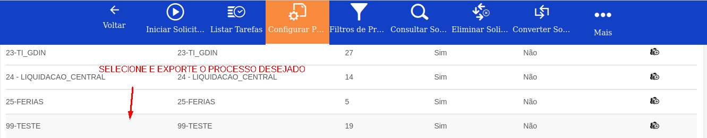

Será baixado um arquivo.zip, você deve inseri-lo na pasta do repositório do git que você criou, neste caso: form-99-TESTE

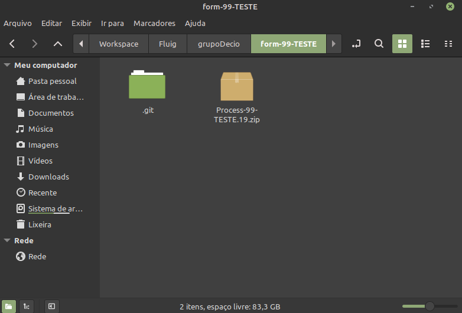

### 1.2 Abrir o Workspace do Eclipse dentro da pasta do repositório Git

Você deve fazer isso para que os próximos desenvolvedores quando clonarem o projeto, já tenham a perspectiva do FLUIG aberta no Eclipse assim que trocarem o workspace do Eclipse para essa pasta contendo o repositório do Git, pois o Eclipse gera alguns arquivos e metadados de configuração de ambiente.

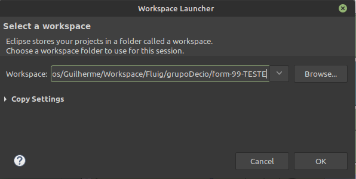

A partir desse momento o processo é o mesmo:

### 1.3 Abra a Perspectiva do FLUIG no Eclipse

### 1.4 Cadastre o servidor FLUIG no qual você baixou o processo.zip

### 1.5 Importe o Projeto FLUIG no Eclipse

Após tudo isso, você ficará com a pasta do repositório Git parecida com isso:

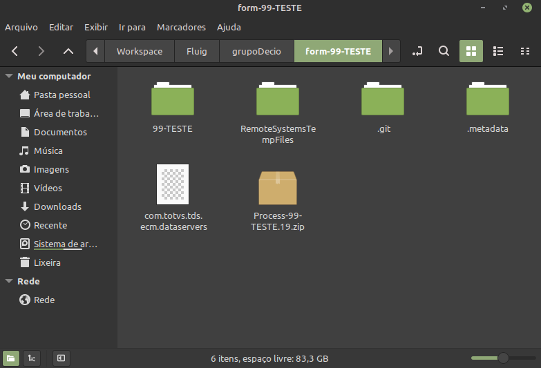
Rodando o comando: git status

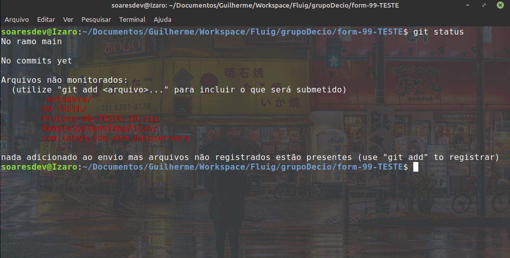

Observe que o Git está observando todas as alterações na nossa pasta, poderiamos enviar as alterações dessa forma, porém queremos que o git **não envie** para o repositório do git o arquivo: **com.totvs.tds.ecm.dataservers**

Que é responsável por se conectar ao servidor FLUIG, já que cada desenvolvedor pode ter um login diferente e essas credenciais ficariam visíveis e acessíveis para qualquer um com acesso aos repositórios, então por questões de segurança, vamos criar um arquivo **.gitignore**

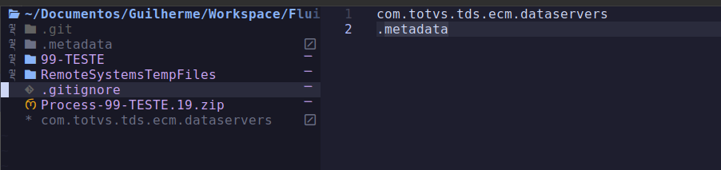

Essas duas linhas significam para o git que ele não deve olhar por alterações nesses arquivos, ou seja, eles não serão enviados para o repositório do git.

Eu inseri também a pasta .metadata pois até o momento me parece ser uma pasta irrelevante e que esta sempre sendo alterada, poluindo a visualização na hora de realizar um commit pela inumera quantidade de pequenos arquivos de metadados que mudam constantemente.

### 1.6 Inserir arquivos para o commit

**Agora sim!** Vamos realizar o nosso primeiro commit e enviar as alterações pro nosso repositório do GitHub

No terminal:

```
git add .
```

Para adicionarmos todos os arquivos presentes (exceto aqueles ignorados pelo git)
Vale salientar que você pode adicionar arquivos individuais, como por exemplo:

```
git add nomeDoArquivo.js
```

Rodando git status novamente, iremos ver todos os arquivos que irão para o nosso commit em verde

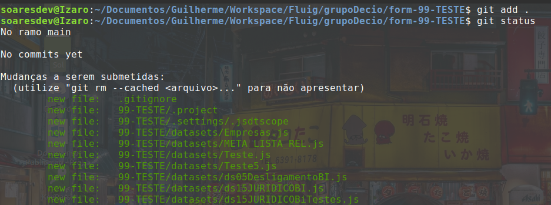

No meu caso, esse processo pertence a homologação, então eu irei criar uma nova branch chamada homolog para armazenar o estado da homologação, caso seja um processo da produção, você realizaria o commit aqui mesmo, na main.

Eu vou rodar:

```
git checkout -b homolog
```

Para criar uma branch chamada homolog e trocar para ela.

O comando: git checkout faz com que você troque de branch

Por exemplo:

```
git checkout main
```

Voltaria para a branch main, já que eu estaria na branch homolog

(Tudo no git é baseado no conceito de arvore e galhos, a main é o tronco da nossa arvore, e todas as outras branchs são galhos)

Quando você troca de branch, o git altera todos os arquivos de acordo com o estado daquela branch na qual o git está controlando

Isto significa que:

Se alguem criou um novo script de fluxo na branch homolog e commitou essas alterações para a mesma, se você der git checkout main, você poderá verificar que esse arquivo não estará mais presente no seu diretório, porque a branch que possui o script é a homolog e não a main.

### 1.7 Realizar o commit

Depois de inserirmos os arquivos desejados pro nosso commit, na branch que queremos, iremos rodar:

```
git commit -m "Mensagem do Commit"
```

Observe que: Embora você tenha criado um commit, essas alterações ainda estão somente na sua maquina, isso porque você poderia trabalhar offline e quando conseguisse rede, enviar os commits criados para o repositório remoto através do comando:

```
git push
```

Quando é o primeiro commit de uma nova branch, o git sempre irá pedir para rodar um comando parecido com esse:

```
git push --set-upstream origin homolog
```

## CUIDADO COM AS VERSÕES

Por esse mesmo motivo de podermos trabalhar offline que sempre que formos realizar uma alteração em um repositório git, é costume sempre rodarmos o comando:

```
git pull
```

Para puxarmos todas as alterações do repositório remoto daquela branch, garantindo que não iremos realizar alterações em uma versão antiga do projeto.

### Pois imagine a situação:

Eu como desenvolvedor de uma equipe ficticia, na semana passada criei uma branch chamada sprint4/guilherme para realizar as alterações que me foram requisitadas naquela sprint.

No final da sprint após os testes, meu chefe deu merge nas alterações (enviou as alterações da minha branch e de meus colegas desenvolvedores para a main)

Depois dessas alterações, a minha branch main ficou desatualizada, então:

```
git checkout main (Voltar para a main)
git pull (Puxar as alterações, já que o estado da minha main localmente estava desatualizada)
```

Nesse momento, minha branch ficou atualizada, se eu criar uma nova branch a partir da main, quando eu realizar um commit e for necessário dar merge, não haverá conflito de versões.

**Agora**, imagine que eu não tenha dado pull, somente criei uma nova branch chamada:

sprint5/guilherme

no final da sprint, quando meu chefe fosse dar merge na main, ele veria que minha branch está atrasada em uma semana e provavelmente ele precisaria resolver conflitos de merge, que teria sido evitado se eu tivesse puxado as alterações que eu e meus colegas fizemos na sprint passada.
